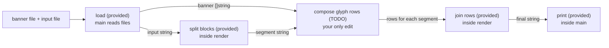

# ascii-render

Complete the `TODO` in pre-opened `main.go`. The program loads files,
splits blocks, and prints `render`'s result.

The banner contains printable ASCII glyphs `32..126`, in order.
First line is blank. Each character uses a 9-line slot: 8 glyph rows,
then a separator before the next slot. The final glyph has no trailing separator.

For each non-empty input block, produce exactly 8 output rows. An output row is
formed by appending the corresponding glyph row for every input character from
left to right. Input contains only printable ASCII. A literal `\n` (the two
characters backslash and `n`) separates stacked blocks; the provided code
already handles that split. An empty segment contributes one empty output line.

Preserve all spaces: output is byte-exact, including spaces at the ends of lines.
The complete rendered result ends with exactly one single final newline.

### How it fits



### Input

```text
HI
```

### Output

Here `$` only marks the end of each line; it is not part of the output.

```text
 _    _   _____  $
| |  | | |_   _| $
| |__| |   | |   $
|  __  |   | |   $
| |  | |  _| |_  $
|_|  |_| |_____| $
                 $
                 $
```

## Useful references

- https://pkg.go.dev/strings#Builder
- https://go.dev/ref/spec#Index_expressions
