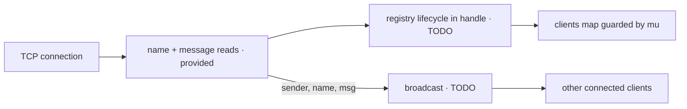

# broadcast

The editor contains `chat/main.go`. Complete two learner-owned regions:

- `broadcast(sender, name, msg)` sends `[name]: message\n` to every currently
  connected client except `sender`. The sender must not receive its own message.
- In `handle`, register the connection after its name is read and ensure it is
  removed when that handler ends.

Each connection is handled concurrently. Every access to the shared `clients`
map must therefore be goroutine-safe using the provided `mu`. A disconnect must
not crash the server, disconnect other clients, or leave the departed client in
the registry.

Listener setup, the first-line name handshake, the message-read loop, and
connection closing are provided. Client names and messages are newline-terminated;
blank message lines are ignored by the driver.

For example, when Alice sends `hello`, every other connected client receives
exactly `[Alice]: hello\n`; Alice receives nothing.

## Useful references

- https://pkg.go.dev/sync#Mutex
- https://go.dev/blog/maps
- https://pkg.go.dev/net#Conn
