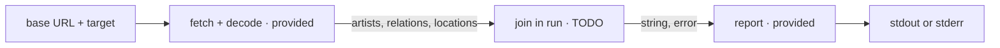

# consume-join

The editor contains `client/main.go`. Complete the single TODO inside
`run(base, target)`.

The provided code fetches and decodes three endpoints:

- `/artists`: artist `id`, `name`, and `firstAlbum`
- `/relation`: an `artistId` and its `locationIds`
- `/locations`: location `id` and `name`

Join these values by ID for the artist whose name equals `target`. Return exactly:

```text
firstAlbum: <album>
locations: <name, name, ...>
```

Both lines end with `\n`. Location names must be alphabetical and separated by
`, `. If the artist is absent, return a non-nil error and no output string.
The graded API supplies complete relation and location data; HTTP, status and JSON
errors are already returned by the provided `getJSON` helper.

The required packages are pre-imported. Fetching/decoding and the final stdout or
stderr reporting are provided.



## Useful references

- https://pkg.go.dev/sort#Strings
- https://go.dev/blog/maps
- https://pkg.go.dev/fmt#Sprintf
