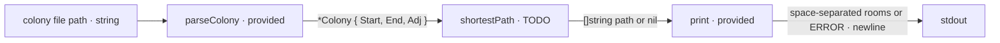

# lemin-path

The editor already contains `lemin/main.go`. Implement only the TODO in:

```go
func shortestPath(c *Colony) []string
```

The program receives a colony-file path. The provided `parseColony` function
reads that file and gives you a `*Colony`:

- `Start` and `End` are the endpoint room names.
- `Adj[room]` contains that room's neighbours; every tunnel is undirected.

You may assume the colony file is valid.

Return one path from `Start` to `End` that uses the fewest tunnels. The returned
slice must contain both endpoints in order, and every consecutive pair must be
connected in `Adj`. If several shortest paths exist, any one is accepted. Return
`nil` when `End` is unreachable from `Start`.

Do not print inside `shortestPath`. The provided `main` prints a non-nil path as
space-separated room names followed by one newline. For `nil`, it prints `ERROR`
followed by one newline. Print no other output.

For example, if both `start-a-end` and `start-b-end` exist, either
`[]string{"start", "a", "end"}` or `[]string{"start", "b", "end"}` is valid.



## Useful references

- https://go.dev/blog/maps
- https://go.dev/ref/spec#Slice_types
- https://go.dev/ref/spec#For_range
