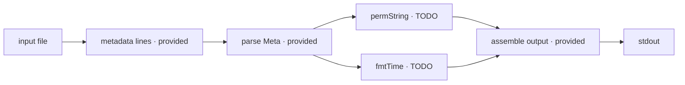

# ls-format

The editor contains `ls-format/main.go`. Implement only:

```go
func permString(typ, octal string) string
func fmtTime(epoch int64) string
```

`permString` returns the 10-character `ls -l` permission field. Its first
character is `-` for type `f`, `d` for type `d`, or `l` for type `l`; the next
nine characters are the `rwx` bits encoded by the supplied three-digit octal
mode. For example, `f 644` becomes `-rw-r--r--`.

`fmtTime` interprets the Unix epoch in UTC and formats it with Go layout
`Jan _2 15:04`. The `_2` position space-pads a single-digit day.

The program receives one input-file path. Every line in that file has this
shape:

```text
<type> <mode> <nlink> <owner> <group> <size> <epoch> <name>
```

Parsing and output assembly are provided. The program prints one formatted line
per input line, including a newline after the final line. Output fields are
separated by one space; column alignment and filesystem access are outside this
exercise.



## Useful references

- https://pkg.go.dev/strconv#ParseInt
- https://pkg.go.dev/time#Unix
- https://pkg.go.dev/time#Time.Format
