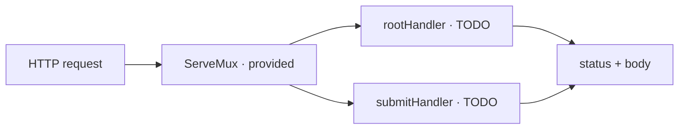

# method-routing

The editor contains `router/main.go`. Implement only `rootHandler` and
`submitHandler`. The `ServeMux`, route registration and listener are provided.

Required route matrix:

| Request | Result |
| --- | --- |
| `GET /` | status `200`, body exactly `home` |
| another method on `/` | status `405` |
| `POST /submit` with a non-empty `name` form field | status `200`, body exactly `submitted` |
| `POST /submit` with a missing or empty `name` | status `400` |
| another method on `/submit` | status `405` |
| any unknown path | status `404` |

Error-response bodies are not graded. Success bodies are byte-exact and have no
added newline.

The provided `ServeMux` registers `/` as a catch-all, so `rootHandler` also
receives paths without a more specific route and must return `404` for them.

## Useful references

- https://pkg.go.dev/net/http#Handler
- https://pkg.go.dev/net/http#Request.FormValue
- https://pkg.go.dev/net/http#ResponseWriter
