# push-swap

The editor already contains `push-swap/main.go`. Implement only the TODO in:

```go
func sort()
```

The provided `main` converts the command-line arguments into the global stack
`a`. You may assume the input contains at most 5 distinct valid integers. Index
`a[0]` is the top of stack `a`. Stack `b` starts empty.

`do(op)` is provided. Call it for each move you want the grader to replay:

| Operation | Effect |
|---|---|
| `pa` | Move the top of `b` to the top of `a`. |
| `pb` | Move the top of `a` to the top of `b`. |
| `sa`, `sb` | Swap the top two values of `a` or `b`. |
| `ss` | Apply both `sa` and `sb`. |
| `ra`, `rb` | Rotate `a` or `b`: top moves to bottom. |
| `rr` | Apply both `ra` and `rb`. |
| `rra`, `rrb` | Reverse-rotate `a` or `b`: bottom moves to top. |
| `rrr` | Apply both `rra` and `rrb`. |

Every call to `do` is recorded in `log` and counts as an operation. If its
source is empty or a stack is too short for that effect, that stack is unchanged.

When `sort` returns, stack `a` must be ascending with its smallest value at
`a[0]`, and stack `b` must be empty. Use fewer than 12 operations. If `a` is
already sorted, issue no operations.

The provided `main` prints `log` as one operation per line, with a newline after
each operation. If no operation was issued, print nothing. Print no other output.

For example, arguments `3 2 1` may produce:

```text
sa
rra
```



```mermaid
flowchart LR
    A["command-line args · []string"] --> P["parse into a · provided"]
    P -->|"a []int · top at a[0]; b []int · empty"| S["sort · TODO"]
    S -->|"zero or more op requests · string"| D["do(op) · provided"]
    D -->|"mutates a, b; appends"| L["log · []string"]
    L --> O["print · provided"]
    O -->|"one operation per line"| X["stdout"]
```

## Useful references

- https://go.dev/ref/spec#Slice_types
- https://pkg.go.dev/builtin#append
- https://go.dev/ref/spec#For_range
