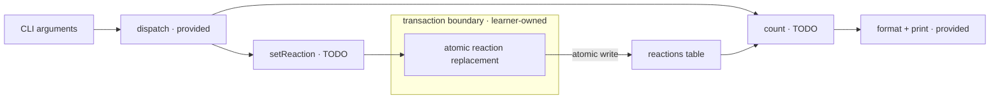

# reactions

The editor contains editable `reactions/main.go` and a read-only `schema.sql`
tab. Implement only:

```go
func setReaction(db *sql.DB, user, post int, value string) error
func count(db *sql.DB, post int) (likes, dislikes int, err error)
```

The `reactions` table has `user_id`, `post_id`, and `value` columns and no
uniqueness constraint. `value` is always `like` or `dislike`. Use a
`database/sql` transaction to preserve the rule below.

After a successful `setReaction`, the table contains exactly one reaction for
that `(user, post)` pair. A new value replaces the previous value; repeating the
same value remains one row. The replacement is atomic: if it fails, return the
error and leave the previous committed row unchanged.

Calls for the same pair may overlap. Successful overlapping calls may take
effect in either order, but they must still leave exactly one row. Until a
replacement commits, other database operations must continue to see the
previous committed row, never the transaction's partial work.

`count` returns the current number of likes and dislikes for the requested post.
If one kind has no rows, its count is zero. The two counts represent distinct
users under the invariant maintained by `setReaction`.

If a SQL operation fails, return its error to the provided driver. CLI parsing,
database opening, command dispatch and the exact count output are provided:

```text
likes=<L> dislikes=<D>
```



Example: if user 1 likes a post twice and then dislikes it, that post contains
one dislike for user 1, not three rows.

## Useful references

- https://pkg.go.dev/database/sql#DB.Begin
- https://pkg.go.dev/database/sql#Tx
- https://pkg.go.dev/database/sql#DB.QueryRow
