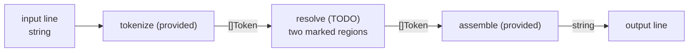

# reloaded-format

Complete the two marked `TODO` regions inside `resolve` in
`reloaded-format/main.go`. Tokenization, punctuation assembly, file input, and
output are already provided.

Apply these rules:

- `(hex)` and `(bin)` replace the previous real word with its decimal value,
  interpreted in base 16 or base 2. Skip punctuation when locating that word.
  If there is no previous word or it is invalid for the requested base, leave it
  unchanged.
- A word that is exactly `a` or `A` becomes `an` or `An` when the next real word
  starts with `a`, `e`, `i`, `o`, or `u`, in either case. Skip punctuation when
  locating the next word. Apply this rule to the text after conversions.

Directives do not appear in the output. The provided assembler drops empty word
tokens, places one space between words, and attaches punctuation directly to the
preceding word. Output is byte-exact: process lines independently, preserve
existing newline separators, and do not append a newline that was not present.

### How it fits



### Examples

```text
input:  I have FF (hex) apples , and a orange .
output: I have 255 apples, and an orange.
```

Invalid numbers remain unchanged:

```text
input:  zzz (hex) and 1111 (bin)
output: zzz and 15
```

## Useful references

- https://pkg.go.dev/strconv#ParseInt
- https://go.dev/ref/spec#Slice_types
- https://go.dev/ref/spec#For_range
