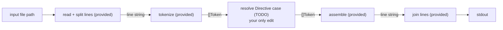

# reloaded-rev

The program receives an input-file path and writes the transformed contents to
standard output. Complete the single `TODO` in the `Directive` case inside
`resolve` in `reloaded/main.go`; file reading, line tokenization, traversal, and
output assembly are provided.

Graded input words contain ASCII characters only.

Directives have the form `(name)` for one word or `(name, n)` for the preceding
`n` words. A non-positive count affects no words.

For each directive, affect the last `Count` word tokens already present:

- `up` makes every character uppercase, `low` makes every character lowercase,
  and `cap` makes the first character uppercase and the remainder lowercase.
- `rev` reverses the positions of those words.

Punctuation is not a word and keeps its token position. The directive itself
does not appear in the output. If `Count` is larger than the number of available
words, affect all available words without panicking.

The provided assembler drops empty word tokens, places one space between words,
and attaches punctuation directly to the preceding word. Output is byte-exact.
Process lines independently, preserve existing newline separators, and do not
append a newline that was not present in the input.

### How it fits



### Examples

```text
input:  the quick brown fox (rev, 3)
output: the fox brown quick
```

Only words move; punctuation stays in place:

```text
input:  red green , blue (rev, 3)
output: blue green, red
```

## Useful references

- https://pkg.go.dev/strings#ToUpper
- https://pkg.go.dev/strings#ToLower
- https://go.dev/ref/spec#Slice_types
