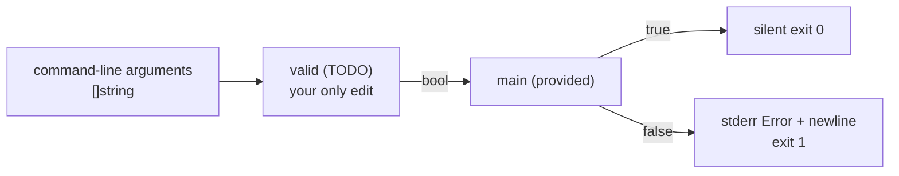

# validate-stack

Complete the single `TODO` inside `valid` in the pre-opened `main.go`. The
provided `main` already maps the returned boolean to the required process
output and exit status.

Return `true` exactly when every argument is a signed base-10 integer accepted
by Go's `strconv.Atoi` and all parsed numeric values are distinct. Values must
fit Go's `int` range. Different spellings of the same value are duplicates, so
`1` and `01` conflict, as do `-0` and `0`.
The grader runs 64-bit Go: `+10` and `2147483648` are valid integers, while
`0x10` is not a base-10 integer.

No arguments and one valid argument are accepted.

- Valid input: write nothing to stdout or stderr and exit `0`.
- Invalid or duplicated input: write exactly `Error\n` to stderr, write nothing
  to stdout, and exit `1`.

Sorting is not part of this exercise.

### How it fits



### Examples

```text
args: 3 1 2
result: silent exit 0

args: 1 01
result: stderr "Error\n", exit 1

args: 1 2.5 3
result: stderr "Error\n", exit 1
```

## Useful references

- https://go.dev/blog/maps
- https://pkg.go.dev/strconv#Atoi
- https://go.dev/ref/spec#For_range
